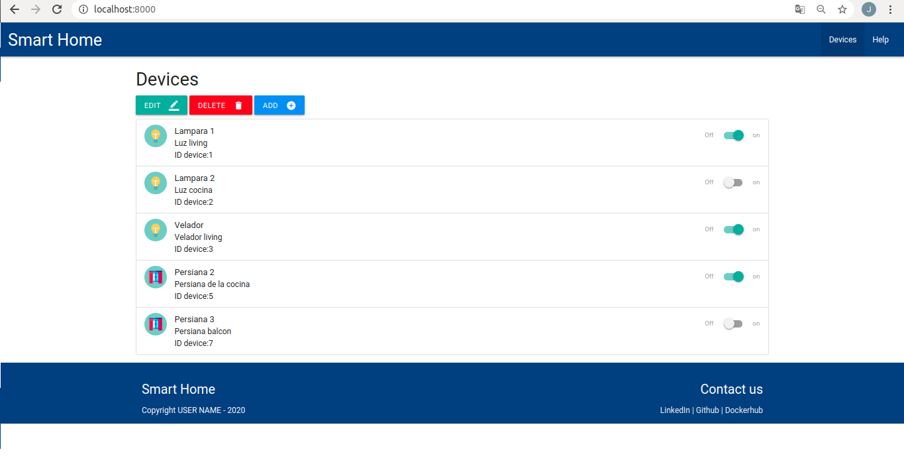

# Trabajo practico final

Autor:

* Severiche Jose

Docentes:

* Agustin Bassi
* Brian Ducca
* Santiago Germino

Template project for Web Applications Development.

To read all project documentation, please go to its wiki in [this link](https://github.com/ce-iot/daw-project-template/wiki).

## Contenidos

* Introducción
* Instalación de Herramientas
* Ejecución de la aplicación
* Licencia

## Introducción 

El presente trabajo práctico final de la materia Desarrollo de Aplicaciones Web tiene por objetivo el diseño de una Single Page Application (SPA) aplicado a la domotica para controlar dispositivos inteligentes que son utilizados en el hogar. Este proyecto fue elaborado durante las clases y La propuesta consistió en aplicar los conceptos vistos en la materia para implementar nuevas funcionalidades al diseño.

## Instalación de Herramientas

La aplicación fue desarrollada sobre un contenedor Docker, motivo por el cual es necesario instalar algunas dependencias antes de poder ejecutarla. Antes de realizar los siguientes pasos es necesario tener instalado Docker y Docker Compose. En la documentación oficial de [Docker](https://docs.docker.com/engine/install/ubuntu/) y de [Docker Compose](https://docs.docker.com/compose/install/) están los pasos para instalar las herramientas en todas las plataformas.

## Ejecución de aplicación

La aplicación Smart Home se ejecuta cuando un navegador se comunica con el servidor web mediante el envío de solicitudes HTTP. Dicho servidor utiliza la tecnología Node.js para que, una vez establecida la conexión, se intercambien datos y que el navegador pueda presentar la aplicación web. La siguiente imagen muestra lo que vería el usuario al momento de ejecutarla.

## Editar dispositivo

Para editar un dispositivos existente haga click en el botón “EDIT”, Luego se abrirá un ventana en donde primero deberá ingresar  en ID del dispositivo que desea modificar y los parámetros que desea modificar de dicho dispositivo, una vez ingresado los parámetros presione el botón “ACEPTAR”, y luego el botón “SALIR” o presione la tecla escape. La siguiente imagen muestra la ventana de editar.

## Eliminar Dispositivo

Para eliminar el dispositivo presione el botón “DELETE”, Luego se abrirá una ventana en donde deberá seleccionar el ID del dispositivo a eliminar, una vez ingresado el ID presione el botón “Aceptar”, luego presione el botón salir o escape. 

## Agregar Dispositivo

Para agregar un dispositivo presione el botón “ADD”, luego se abrirá una ventana en donde deberá ingresar los parámetros requeridos del dispositivo que desea agregar. A continuación presioné aceptar y el dispositivo estará disponible en la lista de dispositivos existentes.

## Licence

This project is published under GPLV3+ licence.

